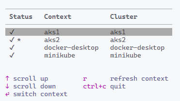

# kubectl-contextmgr
 A kubectl plugin to interactively explore and manage Kubernetes contexts. 

 You may be using multiple clusters for research and experimental purposes while simultaneousy supporting production clusters. One typical problem that we face is that some of these clusters may be powered-off or unreachable. This aspect cannot be verified unless we switch to the context and try any kubectl commands. This plugin was born out of solving this need. 

 For this use case, the best way to present the user with necessary information is to build a simple Terminal User Interface (TUI).

## Install the plugin
 This plugin supports Linux and Windows operating systems on the AMD64 architecture only at the moment. You can download the required binary from the [releases](https://github.com/rchaganti/kubectl-contextmgr/releases) page. You must unpack the binary to a location available within the PATH environment variable.

 > The Krew index submission of this plugin is in progress. Once that is complete, you will be able to install the plugin using the Krew plugin.

## Run the command
 Once the plugin is installed, you can verify the install by running `kubectl contextmgr --version`.

```shell
PS C:\> kubectl contextmgr --version
contextmgr version 0.0.1 (Built on 2024-12-16T20:25:41+05:30 from Git SHA a807b7d)
```

To see a list of contexts available in the default kubeconfig:

```shell
PS C:\> kubectl contextmgr
```

This command brings up the interactive TUI.

You can specify a different kubeconfig file using the `--kubeconfig` flag.

```shell
PS C:\> kubectl contextmgr --kubeconfig .temp/config
```



## Available features
 - Indicate the reachability of the cluster within the context.
 - Indicate the current context.
 - Allow switching between contexts.

## Features - TODO
 - Delete context and cluster